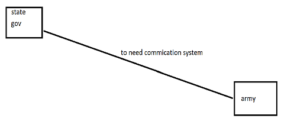
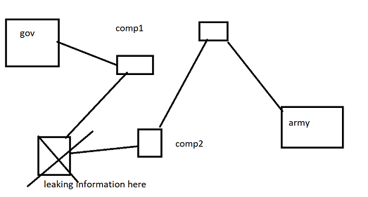
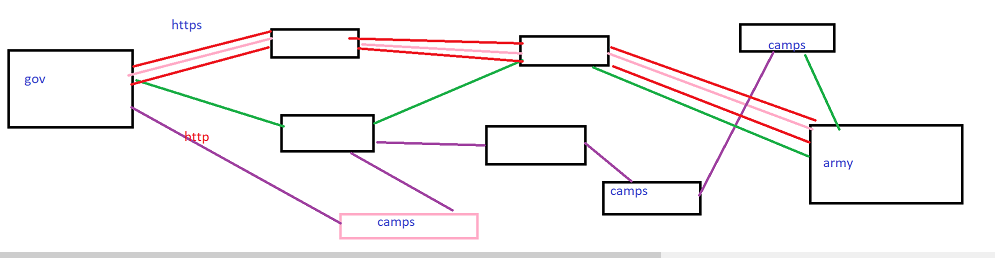
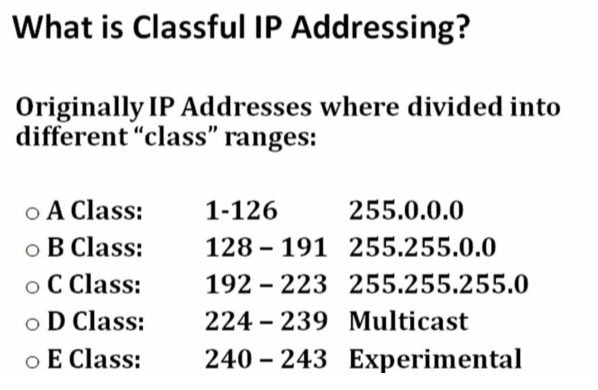
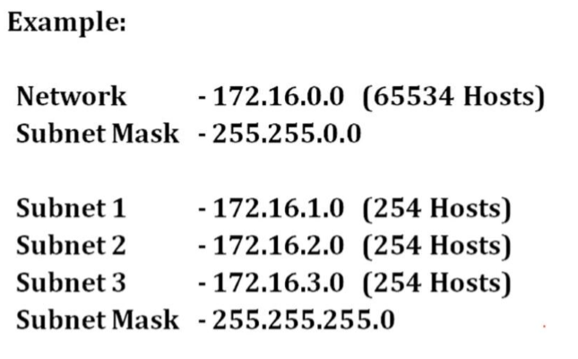
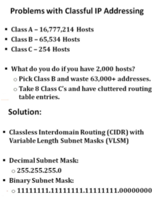
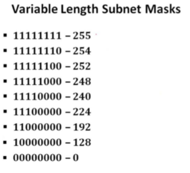
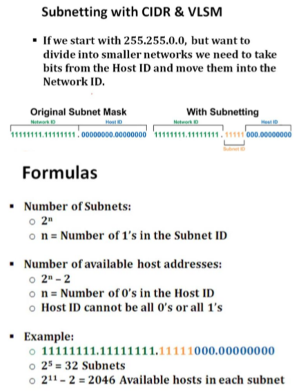

# Network
## The pic shows how networks used 
#### 1.Normal used for communcation
    its failure due to leekage of data
    the length of network is too big
    communcation leake in before reached

#### 2.Improve communcation  http
    length of network is divided into multiple camps
    the information transport in different ways
    but here the leak of information in camps 

#### 3.https
    the information is transver in different ways
    the data have secure because of provide a security layer to the network
    the information now safe to communication

## What is IP address
    * A 32 bit address that is used to uniquely identify a computer network
    * the network ID portion of the Ip address identifies the network where the computer sists
    * the host ID portion of the IP address unquely identifies the computer on its network 

    example : 
        192.168.0.0
    network id + host id

## purpose of subnet mask

#### example :
    IP Address  : 192.168.10.0
    subnet mask : 255.255.255.255
        192.168 = network ID
        10.0    = host Id

#### Rules for ip Address
    Each of 4 number in ip is called octet (8bit)
    A bit is 1 or 0
    each octet have only numbers from 0-255
        * 00000000=0
        * 11111111=255
    the network host doesn't contain all 0 or all 255
        all 0 = network ID 
        all 255 = Brodacast address

    A class = 126Networks & 16,777,214 hosts
    B class = 16,384 networks & 65,534 hosts
    c class = 2,097,152 networks & 254 Hosts

    total = 3,720,314,628 host Addressing

#### Private Vs Public IP Addressing

    * private ip range which have been reserved from public internet use :
     1. 10.0.0.0    - 10.255.255.255
     2. 172.16.0.0  - 172.16.255.255
     3. 192.168.0.0 - 192.168.255.255
     4. 169.254.0.0 - 169.254.255.255

## CIDR (classless Interdomain Routing)

#### cidr Notation
    * without cidr notation 
        * 192.168.10.0
          255.255.255.248
    
    * with cidr Notation
        * 192.168.10.0/29