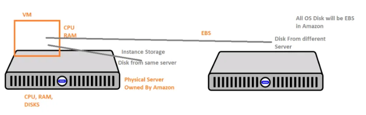

## Storages

## 1.Data storage
#### Instance Store & Elastic Block Storage 
* In AWS we work on virtual machines & virtual storages.

* Virtual Machines are created on Physical Servers. The Disk of the Virtual Machine can be attached from
    * Same Physical Server => Instance Store
    * Different Physical Server in the Same AZ => EBS
* In AWS, for VM (EC2) the operating system disk (os disk/root disk) will always be EBS
* User will get options of Instance Store only for additional disks (Only for some instance types)

---
### how to create ebs volume
