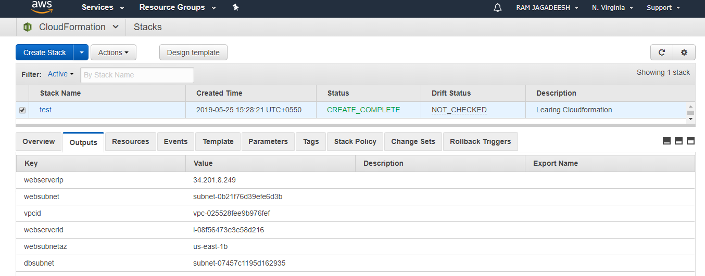

# create a json file required install and creating vpc,security...etc

after creating json file 

[preview](./sir.json)

# cloud formation steps

open aws cloud formation

upload the json file to the cloud form

parameters editing in aws cf

[Preview]

now check the parameters and click create option

now check the out put parameters in aws cf

login in ec2 check application install on your instance