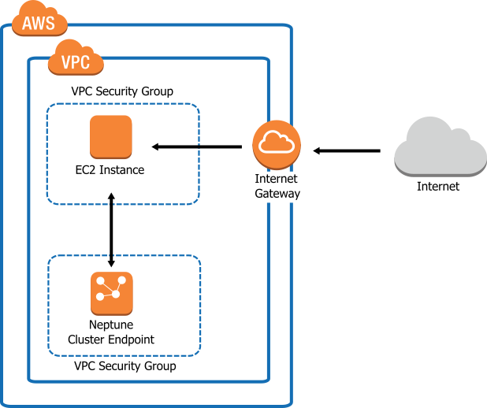

# EC2 instance 
---
* Amazon Elastic Compute Cloud (Amazon EC2) provides scalable computing capacity in the Amazon Web Services (AWS) cloud.
*  Using Amazon EC2 eliminates your need to invest in hardware up front, so you can develop and deploy applications faster. 
*  You can use Amazon EC2 to launch as many or as few virtual servers as you need, configure security and networking, and manage storage. 
*  Amazon EC2 enables you to scale up or down to handle changes in requirements or spikes in popularity, reducing your need to forecast traffic.

# create EC2 instance :-

* Enter the EC2 Dashboard
* Create and Configure Your Virtual Machine
---
  * now in the Amazon EC2 console. Click Launch Instance 
  * you are shown options to choose an Amazon Machine Image
  * choose an instance type
  * Instance types comprise of varying combinations of CPU,     memory, storage, and networking capacity so you can         choose    the appropriate mix for your applications. 
  * For more information, see Amazon EC2 Instance Types.
  * selct the default option of t2.micro - this instance type   is covered within the free tier. 
  * Then click Review and Launch at the bottom of the page.
 ---
* Create a Key Pair and Launch Your Instance

# ec2 size 

# configure of instance
* Configure Instance Details, choose Network, and then choose the entry for your default VPC. It should look something like vpc-xxxxxxx (192.168.0.0/16) (default).

* Choose Subnet, and then choose a subnet in any Availability Zone.
* Choose Next: Add Storage.
* Choose Next: Tag Instance.
* Name your instance and choose Next: Configure Security Group.
* In Step 6: Configure Security Group, review the contents of this page, ensure that Assign a security group is set to Create a new       security group, and verify that the inbound rule being created has the following default values.

     Type: SSH

     Protocol: TCP

     Port Range: 22

     Source: Anywhere 0.0.0.0/0

# working with aws instance

* An EC2 instance is a virtual server in Amazon’s Elastic Compute Cloud (EC2) for running applications on the Amazon Web Services (AWS) infrastructure.  
* AWS is a comprehensive, evolving cloud computing platform; EC2 is a service that allows business subscribers to run application programs in the computing environment. The EC2 can serve as a practically unlimited set of virtual machines. 
* Amazon provides a variety of types of instances with different configurations of CPU, memory, storage, and networking resources to suit user needs. Each type is also available in two different sizes to address workload requirements.
* Instance types are grouped into families based on target application profiles. These groups include: general purpose, compute-optimized, GPU instances, memory optimized, storage optimized and micro instances.

# create Image 

* To create an Amazon EBS-backed Linux AMI, start from an instance that you've launched from an existing Amazon EBS-backed Linux AMI.
* This can be an AMI you have obtained from the AWS Marketplace, an AMI you have created using the AWS Server Migration Service or VM     Import/Export, or any other AMI you can access. After you customize the instance to suit your needs, create and register a new AMI,     which you can use to launch new instances with these customizations.
  
  # create AIM instance from image

  

  * ou can create an AMI using the AWS Management Console or the command line. The following diagram summarizes the process for creating an Amazon EBS-backed AMI from a running EC2 instance. 
  * Start with an existing AMI, launch an instance, customize it, create a new AMI from it, and finally launch an instance of your new AMI. The steps in the following diagram match the steps in the procedure above.

# VM-level backup and recovery
* The elephant gun approach - when you absolutely positively have to back up everything - is to copy the contents of an EC2 machine. You don't really copy the machine itself: you copy a disk volume. Behind the scenes, the volume is reduced to one fat image file and some meta-data.

* AWS make it easy to litter their storage with your backups. If an enterprise uses these volumes as its backup strategy, storage use spirals. The enterprise ends up with thousands of files in many cloud storage areas and has quite a job keeping track of the what is being stored, how much is being stored, and how much it is costing. The enterprise's spanner-wielding officers archive their work using a storage service like AWS S3, and bean-counting officers monitor the financial implications using a cost monitoring service like Uptimecloud.
  
#  Make a backup snapshot using the AWS console
This is a simple backup procedure for taking one snapshot and storing it in EBS. A snapshot is a copy of a disk volume. A snapshot is not a complete copy - it is only the bits that have changed since the last snapshot.

# AutoScalling & LoadBalancing
---
# auto scalling

* Amazon EC2 Auto Scaling helps you ensure that you have the correct number of Amazon EC2 instances available to handle the load for your application. 
* You create collections of EC2 instances, called Auto Scaling groups. 
* You can specify the minimum number of instances in each Auto Scaling group, and Amazon EC2 Auto Scaling ensures that your group never goes below this size. 
* You can specify the maximum number of instances in each Auto Scaling group, and Amazon EC2 Auto Scaling ensures that your group never goes above this size. 
* If you specify the desired capacity, either when you create the group or at any time thereafter, Amazon EC2 Auto Scaling ensures that your group has this many instances. If you specify scaling policies, then Amazon EC2 Auto Scaling can launch or terminate instances as demand on your application increases or decreases.
  

* If you've signed up for an AWS account, you can access Amazon EC2 Auto Scaling by signing into the AWS Management Console, choosing     EC2 from the console home page, and then choosing Auto Scaling Groups from the navigation pane.
* You can also access Amazon EC2 Auto Scaling using the Amazon EC2 Auto Scaling API. Amazon EC2 Auto Scaling provides a Query API.
* These requests are HTTP or HTTPS requests that use the HTTP verbs GET or POST and a Query parameter named Action.

# Pricing for Amazon EC2 Auto Scaling
* There are no additional fees with Amazon EC2 Auto Scaling, so it's easy to try it out and see how it can benefit your AWS architecture.

# Load Balancer
* All of the containers that are launched in a single task definition are always placed on the same container instance. For Classic Load Balancers, you may choose to put multiple containers (in the same task definition) behind the same load balancer by defining multiple host ports in the service definition and adding those listener ports to the load balancer

types of load balancer

#  Application Load Balancer
            
Network Load Balancer
A Network Load Balancer makes routing decisions at the transport layer (TCP/SSL). It can handle millions of requests per second. After the load balancer receives a connection, it selects a target from the target group for the default rule using a flow hash routing algorithm. It attempts to open a TCP connection to the selected target on the port specified in the listener configuration. It forwards the request without modifying the headers. Network Load Balancers support dynamic host port mapping. For example, if your task's container definition specifies port 80 for an NGINX container port, and port 0 for the host port, then the host port is dynamically chosen from the ephemeral port range of the container instance (such as 32768 to 61000 on the latest Amazon ECS-optimized AMI). When the task is launched, the NGINX container is registered with the Network Load Balancer as an instance ID and port combination, and traffic is distributed to the instance ID and port corresponding to that container. This dynamic mapping allows you to have multiple tasks from a single service on the same container instance. For more information, see the User Guide for Network Load Balancers.

# Classic Load Balancer
* A Classic Load Balancer makes routing decisions at either the transport layer (TCP/SSL) or the application layer (HTTP/HTTPS). Classic Load Balancers currently require a fixed relationship between the load balancer port and the container instance port. 
* For example, it is possible to map the load balancer port 80 to the container instance port 3030 and the load balancer port 4040 to the container instance port 4040. 
* However, it is not possible to map the load balancer port 80 to port 3030 on one container instance and port 4040 on another container instance. 
* This static mapping requires that your cluster has at least as many container instances as the desired count of a single service that uses a Classic Load Balancer. For more information, see the User Guide for Classic Load Balancers.

# Network Load Balancer            
* A Network Load Balancer makes routing decisions at the transport layer (TCP/SSL). It can handle millions of requests per second. After the load balancer receives a connection, it selects a target from the target group for the default rule using a flow hash routing algorithm. It attempts to open a TCP connection to the selected target on the port specified in the listener configuration. 
* It forwards the request without modifying the headers. Network Load Balancers support dynamic host port mapping. For example, if your task's container definition specifies port 80 for an NGINX container port, and port 0 for the host port, then the host port is dynamically chosen from the ephemeral port range of the container instance (such as 32768 to 61000 on the latest Amazon ECS-optimized AMI). 
* When the task is launched, the NGINX container is registered with the Network Load Balancer as an instance ID and port combination, and traffic is distributed to the instance ID and port corresponding to that container. This dynamic mapping allows you to have multiple tasks from a single service on the same container instance.

---

# S3 Buckets

---

* Amazon S3 is cloud storage for the internet. To upload your data (photos, videos, documents etc.), you first create a bucket in one of the AWS Regions. You can then upload any number of objects to the bucket.
* In terms of implementation, buckets and objects are resources, and Amazon S3 provides APIs for you to manage them. For example, you can create a bucket and upload objects using the Amazon S3 API. You can also use the Amazon S3 console to perform these operations. The console uses the Amazon S3 APIs to send requests to Amazon S3.

# create s3 buckets
* Amazon S3 provides APIs for creating and managing buckets. By default, you can create up to 100 buckets in each of your AWS accounts. If you need more buckets, you can increase your account bucket limit to a maximum of 1,000 buckets by submitting a service limit increase.
* When you create a bucket, you provide a name and the AWS Region where you want to create the bucket. For information about naming buckets, 

# see Rules for Bucket Naming.

* You can store any number of objects in a bucket.
* You can create a bucket using any of the following methods:
    * Using the console
    * Programmatically, using the AWS SDKs
  ---