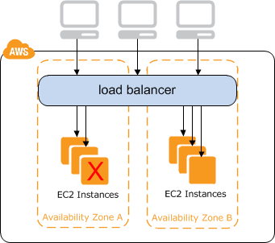

# Load Balancer Types
---

*Elastic Load Balancing supports the following types of load balancers:
 1)Application Load Balancers, 
 2)Network Load Balancers, 
 3)Classic Load Balancers. 
 
 * Amazon ECS services can use either type of load balancer , Application Load Balancers are used to route HTTP/HTTPS (or Layer 7) traffic. 
 * Network Load Balancers and Classic Load Balancers are used to route TCP (or Layer 4) traffic.

---

# Classic Load Balancer Overview

---
* A load balancer distributes incoming application traffic across multiple EC2 instances in multiple Availability Zones. 
* This increases the fault tolerance of your applications. Elastic Load Balancing detects unhealthy instances and routes traffic only to healthy instances.
* Your load balancer serves as a single point of contact for clients. This increases the availability of your application. You can add and remove instances from your load balancer as your needs change, without disrupting the overall flow of requests to your application.
* Elastic Load Balancing scales your load balancer as traffic to your application changes over time. Elastic Load Balancing can scale to the vast majority of workloads automatically.

*To ensure that your registered instances are able to handle the request load in each Availability Zone, it is important to keep approximately the same number of instances in each Availability Zone registered with the load balancer.
* For example, if you have ten instances in Availability Zone us-west-2a and two instances in us-west-2b, the requests are distributed evenly between the two Availability Zones. As a result, 
* the two instances in us-west-2b serve the same amount of traffic as the ten instances in us-west-2a. Instead, you should have six instances in each Availability Zone.
* By default, the load balancer distributes traffic evenly across the Availability Zones that you enable for your load balancer.

---

